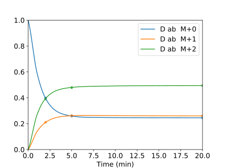

# eiFlux
eiFlux - A software for stable isotope-assisted metabolic flux analysis

*Created by Daniel J. Lugar*  

## Introduction and Setup

eiFlux is written using two languages, Python and GAMS. Python is a general-purpose high-level programming language. GAMS is a proprietary algebraic modeling language designed to
efficiently solve large-scale optimization problems. The model matrices and vectors are assembled in Python, then read into a GAMS Data Exchange (GDX) file using the GAMS/Python API. Following the creation of the GDX file, the GAMS model is prompted to run in the Python script. Following completion of the run, a second GDX file is created, this time by GAMS, which is subsequently read by the Python script and the results displayed.  

To run eiFlux, it is necessary to have Python 3 and GAMS. The Python libraries NumPy, SciPy, and Matplotlib must also be installed. GAMS must have a valid license file which includes the Base Module and the Conopt solver. The GAMS/Python API must also be installed, ensuring that the version and bitness of the Python API is the same as that of Python.    

The local directory containing the eiFlux Python script should also contain a folder called "GAMS_Model". Therein should be two GAMS scripts: eiFlux_GAMS and eiFlux_GAMS_Instationary. eiFlux_GAMS is called when running steady-state data collected at isotope labeling steady-state. eiFlux_GAMS_Instationary is called when fitting time series data. Hereafter, "MFA" will refer to isotopically steady-state metabolic flux analysis, and "inst-MFA" will be used to refer to isotopically nonstationary metabolic flux analysis.  

## Creating a Model

In the local directory containing the eiFlux Python script, create a folder with the name of the model, e.g. "My_Model". Inside this folder, create the following text documents having any name desired (descriptive names were chosen for illustration):  

**modelsettings.txt** - contains the settings for running the model  
**reactions.txt** - contains the metabolic reaction network with carbon atom rearrangements  
**fluxbounds.txt** - contains upper and lower bounds of each flux in the network  
**label.txt** - contains the labeling state the fed isotopically labeled substrate(s)  
**measurements.txt** - contains the mass isotopomer distributions to be fit to the model for flux estimation  
**initfluxes.txt** (*Optional*) - contains initial reaction flux values (initial guess) for the optimization  
**flux_measurements.txt** (*Optional*) - contains measurement values for any measured fluxes  
**poolbounds.txt** (*Inst-MFA only*) - contains the upper and lower bounds on metabolite pool sizes  
**pool_measurements.txt** (*Optional, Inst-MFA Only*) - contains measurement values for any measured metabolite pool sizes  
**initpools.txt** (*Optional, Inst-MFA only*) - contains initial pool size values (initial guess) for the optimization   

In the local directory containing the eiFlux Python script, create a text document called "modelfile" containing the following lines (ensure that the names of the text files in "modelfile" match those in the model to be run):  

```
Model_File_Name: My_Model  
Model_Settings_File_Name: modelsettings.txt  
Reaction_File_Name: reactions.txt  
FluxBound_File_Name: fluxbounds.txt  
Fed_Label_File_Name: label.txt  
Measurement_File_Name: measurements.txt  
Init_Flux_File_Name: initfluxes.txt  
Flux_Measurement_File_Name: rxn_measurements.txt  
PoolBound_File_Name: poolbounds.txt  
Pool_Measurement_File_Name: pool_measurements.txt  
Init_Pool_File_Name: initpools.txt  
```
*If there are no reaction measurements or pool measurement, type "none" rather than "rxn_measurements.txt" or "pool_measurements.txt".*  
*If there is no initial flux distribution or initial pool size distribution, type "none" rather than "initfluxes.txt" or "initpools.txt".*  

### Model Settings File

The "model settings file" was called **modelsettings.txt** above. In this file, include the following lines:  

```
13C_Natural_Abundance: [fraction of carbon atoms being carbon-13]
Cold_Starts: [number of restarts to perform from random initial flux distributions]
Initial_Flux_Values: [1 if a set of initial flux values is provided, 0 otherwise]
Bootstrap_Iterations: [number of warm start bootstrap iterations to perform at the best fit flux solution]
Show_GAMS_Output: [1 to display the GAMS output as it is running, 0 to silence it]
NLP_Solver: [GAMS NLP solver to use, i.e. conopt]
Tandem_MS_Data: [1 if fitting tandem MS data, 0 if fitting single MS data]
Instationary_Model: [1 if fitting isotopically nonstationary data, 0 otherwise]
Create_json_File: [1 to create an Escher-readable json file of the network model, 0 otherwise]
Plot_Results: [1 to plot results as svg files, 0 not to plot. Plots will be named FragmentName_FragmentAtoms_MeasurementLine#]
Font_Size: [optional, font size of text on plots - Default is 12]

(Instationary Models Only)
Collocation_Method: [indicate the name of the Runge-Kutta method used for collocation, e.g. RADAUIIA3O, RADAUIIA5O, or RADAUIIA9O]
Measurement_Time_Points: [indicate the time points at which measurements were taken, in ascending order]
Time_Nodes: [indicate the time interval time nodes in the time domain - must include 0]
Refine_Grid: [1 to take the best solution and use a higher order collocation method to reduce discretization error, 0 otherwise]
Estimate_Grid_Error: [1 to estimate the discretization error in each time interval using a higher order collocation method, 0 otherwise]
Fine_Coll_Method: [name of the collocation method used for grid refinement (must be higher order than "Collocation_Method"; only used if "Refine_Grid" is set to 1)]
Error_Est_Coll_Method: [name of the collocation method used for grid error estimation (must be higher order than "Collocation_Method" and "Fine_Coll_Method"; only used if "Estimate_Grid_Error" is set to 1)]
Initial_Pool_Values: [1 if a set of initial pool values is provided, 0 otherwise]
Time_Units: [optional, will appear in parenthesis on the horizontal axis of the plots - default is nothing]
```

The carbon-13 natural abundance (**13C_Natural_Abundance**) is typically set to be around 0.011 (or 1.1%).  

The number of random restarts to perform (**Cold_Starts**) is the number of times eiFlux will be restarted from a new, randomly chosen flux (and pool size for inst-MFA) distribution. These random restarts are performed because MFA and inst-MFA generally have nonconvex objective functions, i.e. they have multiple local optima. To search for a global optimum, the optimization should be restarted from a number of randomly chosen initial flux (and pool size for inst-MFA) distributions. The random initial flux distributions are generated using a variant of a hit-and-run algorithm that ensures the flux distribution is feasible based on the stoichiometric and flux bound constraints.

A set of initial flux values **Initial_Flux_Values** may be provided as a starting point for the optimization. If this is not provided, the starting point will be a random feasible flux distribution.

eiFlux estimates parameter confidence intervals using bootstrap Monte-Carlo. The number of bootstrap iterations to perform is entered in "**Bootstrap_Iterations**".  

When solving a model, GAMS will output model statistics such as the size of the model and the objective function at a given iteration. For steady-state MFA, the model is usually solved very quickly (within seconds), and analyzing the GAMS output for each restart is unnecessary. For inst-MFA models, it may take several minutes to solve the model from a given initial parameter distribution, and GAMS may provide valuable information to the modeler on the progress of the optimization. For these reasons, the GAMS output may be silenced or unsilenced depending on the preference of the modeler using the flag "**Show_GAMS_Output**".  

Currently, eiFlux only supports the solver Conopt (**NLP_Solver**). Conopt was found to work especially well for the MFA and inst-MFA model structures.  

Tandem MS data is interpreted differently than single MS data. The flag "**Tandem_MS_Data**" tells eiFlux to fit this data type.  

The flag "**Instationary_Model**" tells eiFlux to fit isotopically nonstationary data (inst-MFA).

eiFlux has the capability of generating an Escher-readable JSON file containing the metabolic network model structure using the flag "**Create_json_File**". Escher (King et al., PLOS Comput. Biol., 2015) is an excellent metabolic network visualization tool that is typically used to visualize pathways in large-scale metabolic networks from genome-scale reconstructions. Modelers may use Escher to vizualize their metabolic network developed using eiFlux and also overlay their flux solution onto this flux map. This helps the modeler to vizualize their network as they are developing it, which can aid in the development process in addition to providing a high-quality figure.  

#### Isotopically Nonstationary Models

For isotopically nonstationary models, eiFlux treats the dynamic system using collocation methods. Collocation methods are well-suited for parameter estimation problems involving dynamic systems, and there are several user-inputs to consider when fitting isotopically nonstationary data.

A set of initial pool size values **Initial_Pool_Values** may be provided as a starting point for the optimization (in addition to initial flux values). If this is not provided, the starting point will be a random feasible pool size distribution.

The measurement time points (**Measurement_Time_Points**) should be listed in ascending order, each separated by a space. These are the time points at which the measurements were taken. The grid time points (**Time_Nodes**) should start with '0' and be listed in ascending order. The final grid time point should be equal to or greater than the largest measurement time point. The grid time points do not need to include the measurement time points. Measurements whose times fall between two grid time points are approximated using the polynomial solution approximation (so-called 'dense output' property of collocation methods).  

Currently, eiFlux supports Radau IIA collocation methods (which are also Runge-Kutta methods). eiFlux supports these methods of 3rd, 5th, and 9th order. The best performance has been observed by performing the random restarts using a lower order method (**Collocation_Method**), i.e. 3rd order Radau IIA (RADAUIIA3O), then taking the best fit solution from those restarts and performing a refinement with a higher order method (**Fine_Coll_Method**), i.e. 5th or 9th order Radau IIA (RADAUIIA5O or RADAUIIA9O, respectively).  

One may choose to have eiFlux estimate the discretization error of their chosen grid points. This is done by taking the best fit solution and solving the state equations using a higher order collocation method (**Error_Est_Coll_Method**) while keeping the parameter values (fluxes and pool sizes) constant. The discretization error for each (continuous) simulated measurement in each time interval is found by comparing the solution from the original collocation method to that found using the higher order method. The error in each time interval is reported as the maximum of the errors of the simulated measurements in that time interval.  

Consider the following example *modelsettings.txt* file for isotopically nonstationary MFA (inst-MFA) models.  

```
13C_Natural_Abundance: 0.0000
Cold_Starts: 20
Initial_Flux_Values: 0
Bootstrap_Iterations: 1000
Create_json_File: 1
Show_GAMS_Output: 1
NLP_Solver: conopt
Tandem_MS_Data: 0
Instationary_Model: 1
Plot_Results: 1
Font_Size: 14

INST-MFA MODELS ONLY

Collocation_Method: RADAUIIA3O

Refine_Grid: 1
Fine_Coll_Method: RADAUIIA5O

Estimate_Grid_Error: 1
Error_Est_Coll_Method: RADAUIIA9O

Measurement_Time_Points: 2 5 10 20
Time_Nodes: 0 1 2 4 8 12 20

Initial_Pool_Values: 0

Time_Units: min
```

### Reaction File

In the reaction file (i.e. *reactions.txt*), network reactions are entered line-by-line along with their carbon atom transitions. Each reaction is given a name by the user. For reversible reactions, the forward and reverse reaction must be entered separately, and the reaction name must have a suffix of **".f"** or **".b"** for the forward and reverse reaction, respectively. Unidirectional reactions do not need a suffix. Networks must be stoichiometrically feasible, i.e. entry and exit fluxes are required for metabolites that enter or leave the network.  

The reaction name may include any letters, symbols, or numbers except: "\*" ":", " ", "+", "-", or ".". Spaces are not allowed in the reaction name, and "." may only be used when specifying a suffix (i.e. ".f" or ".b"). A colon **":"** specifies the end of the reaction name. Following the colon, one or more spaces (or tabs) are entered before writing the reaction.  

*Only lines containing a colon are read by eiFlux, allowing the user to comment their reaction network.*  

Reactions are entered as follows: r1 (r1_atoms) + r2 (r2_atoms) + ... -> p1 (p1_atoms) + p2 (p2_atoms) + ...  

The **"+"** symbol separates multiple reactants and products. Carbon atoms for a corresponding reactant or product are written to the right of the metabolite name, surrounded by parenthesis, **"("** and **")"**. An arrow **"->"** separates the reactant side of the reaction from the product side. For entry and exit reactions, the reactant or product side is omitted, respectively.  

Consider the following example *reactions.txt* file.  

```
ENTRY AND EXIT REACTIONS

A_in:   -> Axt (abc)
B_out:  B (abc) ->

NETWORK REACTIONS

v1:     Axt (abc) -> A (abc)
v2:     A (xyz) -> C (x) + D (yz)
v3:     C (a) + D (bc) -> B (abc)
v4:     A (pQr) -> E (pQ) + F (r)
v5:     E (ab) + F (c) -> B (abc)
v6.f:   A (ab1) -> B (ab1)
v6.b:   B (abc) -> A (abc)
```

Notice that carbon atoms may be specified using lowercase letters, uppercase letters, or numbers. A single character specifies an individual carbon atom. Metabolite names may be any length, but must not contain a space, parenthesis, or a colon.  

For reactions involving symmetric metabolites, for example, *Suc -> Fum*, this may be entered in one of two ways.

```
Suc (abcd) -> 0.5 Fum (abcd) + 0.5 Fum (dcba)
OR
Suc (abcd) + Suc (efgh) -> Fum (abcd) + Fum (hgfe)
```

A reaction may be silenced by inserting an asterisk **"\*"** before the reaction name. This can help the user when developing and troubleshooting a network to fit a given data set.

**Important:** The carbon atoms of a single product metabolite may not come from more than two reactant metabolites. For example *A (ab) + B (c) + D (def) -> G (fedcab)* would **not** be an allowed reaction. However, this reaction could be split into two separate reactions: *A (ab) + B (c) -> G1 (cab)* and *G1 (cab) + D (def) -> G (fedcab)*. A reaction may have any number of products and reactants, as long as this rule is not violated.  

### Flux Bound File

In the flux bound file (i.e. *fluxbounds.txt*), the upper and lower bounds for each reaction are specified. The values for the upper and lower bounds must be nonnegative. For a flux value that is fixed, the upper and lower bounds are identical.  

The upper and lower bounds for each reaction are entered as *rxn_name:  lower_bound upper_bound*  

Consider the following example *fluxbounds.txt* file.  

```
ENTRY AND EXIT REACTIONS

A_in:   1.0 1.0
B_out:  0.0 1000.0

NETWORK REACTIONS

v1:     0.0 1000.0
v2:     0.0 1000.0
v3:     0.0 1000.0
v4:     0.0 1000.0
v5:     0.0 1000.0
v6.f:   0.0 1000.0
v6.b:   0.0 1000.0
```

The influx of metabolite *Axt* into the network is given tight bounds. The upper and lower bounds of this flux are the same. Therefore, this flux (*A_in*) is fixed at the value of 1.0. As a result, all of the other flux values will be computed relative to *A_in*. Notice that all other network reactions have a lower bound of 0.0 and upper bound of 1000.0. When initial flux distributions are computed by eiFlux, they will automatically satisfy both the upper and lower bounds in addition to stoichiometric constraints defined by the network structure. For example, even though *B_out* has an upper bound of 1000.0, based on the network stoichiometry, *B_out* can only have a value of 1.0 since *A_in* is fixed at 1.0. As with the reaction file, only lines containing a colon **":"** are read by eiFlux allowing the user to add comment lines to the flux bound file.

If a reaction is silenced in the reaction file using an asterisk **"\*"** this reaction does not need to be silenced in the flux bound file. Upper and lower bounds listed in the flux bound file will only be considered for reactions that are active in the reaction file. Therefore, if the flux bound file contains flux bounds for a reaction that does not exist in the reaction file, the flux bounds for this reaction will be ignored by eiFlux.  

### Label File

The label file (i.e. *label.txt*) specifies the labeling pattern of the fed isotopically labeled compound. eiFlux is able to simultaneously fit data from multiple experiments with different fed labels. The labeling pattern is specified as a series of binary digits, with **"0"** indicating that the corresponding carbon atom has natural carbon-13 abundance, and **"1"** indicating that the carbon atom is artificially enriched to 100% carbon-13. For example, if *Axt* is artificially 100% enriched at position 1, and has natural carbon-13 abundance at positions 2 and 3, then **"100"** would specify its labeling state.  

Consider the following example *label.txt* file.  

```
expt1   Axt 110 0.80
expt2   Axt 111 0.50
expt2   Axt 001 0.25
```

The first entry in each line of the label file is the experiment name. Here, the names "expt1" and "expt2" were chosen, but they could have any name (without spaces).  The next entry is the metabolite whose labeling state is being specified. Next is the labeling state and the fraction of the metabolite having that labeling pattern. The first line of the example *label.txt* file indicates that 80%% of *Axt* is simultaneously labeled with carbon-13 at positions 1 and 2. The remaining 20% is assumed to be naturally abundant, or "000". For expt2, there are two labeling states of Axt specified. This indicates that Axt is 50% the "111" labeling state and 25% "001". The remaining 25% is assumed to be naturally abundant.

The labeling state is typically only specified for metabolites that enter the network. If a metabolite enters the network, and its labeling state is not specified in the label file, it is assumed to have natural carbon-13 abundance for all carbon atoms.  

(inst-MFA only)
For isotopically nonstationary labeling experiments, the entries in the label file additionally specify the initial labeling state of each metabolite. Metabolites whose initial labeling states are not specified in the label file are assumed to initially have natural carbon-13 abundance for all carbon atoms.

### Measurement File

The measurement file (i.e. *measurements.txt*) specifies the measured metabolite mass isotopomer distributions (MIDs) to fit to the network model. Currently, eiFlux accepts mass spectrometry (MS) and tandem mass spectrometry (MS-MS) data. Prior to entering this data, it must be corrected for natural isotope abundances of other elements (e.g. O, N, H, Si, S, etc.) and non-metabolic carbon (incorporated during derivatization).  


#### Single MS Data

Experimental MS data is entered as follows:  
*experiment_name metabolite_name fragment_atoms MID_m+n_value measurement_value measurement_standard_deviation*

For MS data, consider the following example *measurements.txt* file.  

```
expt1  B ab   0   0.1162  0.0050
expt1  B ab   1   0.1782  0.0100
expt1  B ab   2   0.7056  0.0070
expt1  B bc   0   0.2004  0.0050
expt1  B bc   1   0.7970  0.0080
expt1  B bc   2   0.0026  0.0200
expt1  B abc  0   0.1191  0.0050
expt1  B abc  1   0.1674  0.0050
expt1  B abc  2   0.7004  0.0150
expt1  B abc  3   0.0130  0.0100
expt1  C a    0   0.2047  0.0100
expt1  C a    1   0.7953  0.0050
expt2  B abc  0   0.1711  0.0100
expt2  B abc  1   0.2640  0.0150
expt2  B abc  2   0.2082  0.0100
expt2  B abc  3   0.3567  0.0050
expt2  D ab   0   0.2513  0.0100
expt2  D ab   1   0.2632  0.0050
expt2  D ab   2   0.4854  0.0100
```

Here, the letters "abc", "bc", etc. indicate the carbon atoms of the metabolite's measured mass spectral fragment. The numbers "0", "1", "2", etc. indicate the mass above that which the fragment would have if it were composed entirely of carbon-12. The number to the right of this is the measurement of what fraction of the fragment has that mass. The number to the right of this is the experimental standard deviation of this measurement. A measurement may be silenced by inserting an asterisk **"\*"** as the first entry of that measurement's line.

#### Tandem MS Data

Tandem MS (MS-MS) provides mass distribution data for fragments of fragments of metabolites, potentially providing much more metabolite labeling information than is given by single MS instruments. This type of data is entered differently than single MS data in the measurement file (i.e. *measurements.txt*).

Experimental MS-MS data is entered as follows:  
*experiment_name metabolite_name parent_atoms parent_MID_m+n_value daughter_atoms daughter_MID_m+n_value measurement_value measurement_standard_deviation*

```
expt1  B abc  0  bc  0   0.1146  0.0100
expt1  B abc  1  bc  0   0.0854  0.0050
expt1  B abc  1  bc  1   0.0854  0.0100
expt1  B abc  2  bc  1   0.7146  0.0210
expt1  B abc  2  bc  2   0.0000  0.0055
expt1  B abc  3  bc  2   0.0000  0.0100
expt1  B abc  0  ab  0   0.1146  0.0150
expt1  B abc  1  ab  0   0.0000  0.0190
expt1  B abc  1  ab  1   0.1708  0.0100
expt1  B abc  2  ab  1   0.0000  0.0050
expt1  B abc  2  ab  2   0.7146  0.0075
expt1  B abc  3  ab  2   0.0000  0.0080
expt2  B abc  0  ab  0   0.1738  0.0150
expt2  B abc  1  ab  0   0.1928  0.0190
expt2  B abc  1  ab  1   0.0667  0.0100
expt2  B abc  2  ab  1   0.2002  0.0050
expt2  B abc  2  ab  2   0.0095  0.0075
expt2  B abc  3  ab  2   0.3570  0.0080
expt2  B bc   0  c   0   0.2380  0.0050
expt2  B bc   1  c   0   0.0120  0.0100
expt2  B bc   1  c   1   0.2620  0.0080
expt2  B bc   2  c   1   0.4880  0.0150
expt2  D ab   0  a   0   0.2447  0.0150
expt2  D ab   1  a   0   0.2553  0.0080
expt2  D ab   1  a   1   0.0053  0.0100
expt2  D ab   2  a   1   0.4947  0.0050
```

If a user would like eiFlux to display the MID of a metabolite or fragment that does not have any associated measurements, for example metabolite E fragment b, this is entered as the following lines in the measurement file.  

```
expt1  E b  0  -1 10000
expt1  E b  1  -1 10000
expt2  E b  0  -1 10000
expt2  E b  1  -1 10000
```

In this case, "-1" is entered for the measurements and 10000.0 is entered for the standard deviation of these measurements. In this case, the model will attempt to fit all other measurements, but the entered standard deviation is so high for these measurements that they will not noticeably contribute to the error in the model fit. The simulated measurements will subsequently be displayed upon running eiFlux.


#### Isotopically Nonstationary Data

When performing inst-MFA, it is necessary to fit isotopically nonstationary time-series data. This data is collected over the time course of an experiment. The measurement file (i.e. *measurements.txt*) is constructed similarly to that for steady-state data, except that the time series data and corresponding standard deviations are entered in series.  

For time-series MS data, consider the following example *measurements.txt* file.  

```
expt1  B ab   0   0.3869  0.0050   0.2194  0.0050   0.1648  0.0050   0.1297  0.0050
expt1  B ab   1   0.2823  0.0100   0.3276  0.0100   0.2747  0.0100   0.2102  0.0100
expt1  B ab   2   0.3308  0.0070   0.4530  0.0070   0.5604  0.0070   0.6601  0.0070
expt1  B bc   0   0.4030  0.0050   0.2510  0.0050   0.2168  0.0050   0.2025  0.0050
expt1  B bc   1   0.5970  0.0080   0.7490  0.0080   0.7832  0.0080   0.7975  0.0080
expt1  B bc   2   0.0000  0.0200   0.0000  0.0200   0.0000  0.0200   0.0000  0.0200
expt1  B abc  0   0.3869  0.0050   0.2194  0.0050   0.1648  0.0050   0.1297  0.0050
expt1  B abc  1   0.2823  0.0050   0.3276  0.0050   0.2747  0.0050   0.2102  0.0050
expt1  B abc  2   0.3308  0.0150   0.4530  0.0150   0.5604  0.0150   0.6601  0.0150
expt1  B abc  3   0.0000  0.0100   0.0000  0.0100   0.0000  0.0100   0.0000  0.0100
expt1  C a    0   0.9035  0.0100   0.7243  0.0100   0.5170  0.0100   0.3151  0.0100
expt1  C a    1   0.0965  0.0050   0.2757  0.0050   0.4830  0.0050   0.6849  0.0050
expt2  B abc  0   0.3887  0.0100   0.2335  0.0100   0.2029  0.0100   0.1839  0.0100
expt2  B abc  1   0.2336  0.0150   0.2782  0.0150   0.2698  0.0150   0.2621  0.0150
expt2  B abc  2   0.1787  0.0100   0.2332  0.0100   0.2296  0.0100   0.2178  0.0100
expt2  B abc  3   0.1991  0.0050   0.2550  0.0050   0.2977  0.0050   0.3362  0.0050
expt2  D ab   0   0.3977  0.0100   0.2588  0.0100   -1      10000.0  0.2449  0.0100
expt2  D ab   1   0.2104  0.0050   0.2624  0.0050   -1      10000.0  0.2610  0.0050
expt2  D ab   2   0.3919  0.0100   0.4788  0.0100   -1      10000.0  0.4941  0.0100
```
When entering time-series data, the first two columns of data correspond to the measurements and standard deviations, respectively, for the first measured time point. The next two columns are the measurements and standard deviations for the next measured time point, and so on. Time series data is entered in the same manner for tandem MS-MS measurements. The time-series measurements entered in the measurement file correspond directly to the measured time points indicated in the model settings file (i.e. *modelsettings.txt*). In this example, the measurements for metabolite D (fragment ab) are missing for the third time point. In this case, "-1" is entered for the measurements and 10000.0 is entered for the standard deviation of these measurements. In this case, the model will attempt to fit all other measurements, but the entered standard deviation is so high for these measurements that they will not noticeably contribute to the error in the model fit.

### Pool Bound File (inst-MFA Only)

The pool bound file (*i.e. poolbounds.txt*) is only required when fitting isotopically nonstationary data (inst-MFA). Within this input file, the lower and upper bound of the pool size for each metabolite is specified. The pool bounds must be specified for each metabolite in the network. When the user runs eiFlux, it will display a list of metabolites in the network before asking if the user would like to proceed. The user may use that metabolite list to construct the pool bounds file and ensure they are not missing any metabolites. The pool bounds are entered in the pool bounds file as *metabolite_name pool_lower_bound pool_upper_bound*.  

Consider the following example *poolbounds.txt* file.  

```
Axt  0.0001 10.0
A    0.0001 10.0
B    0.0001 10.0
C    0.0001 10.0
D    0.0001 10.0
E    0.0001 10.0
F    0.0001 10.0
```
Notice that a colon is not included after the metabolite name. Also notice that the pool lower bound cannot be exactly zero, but can be a very small number. A pool lower bound entered as exactly zero can cause numerical difficulties in the optimization algorithm.

### Flux Measurement File (Optional)

The flux measurement file (*i.e. flux_measurements.txt*) is an **optional** input file containing measured flux values and their standard deviations. These measured values may be incorporated when fitting the metabolic model. In the flux measurement file, include one line per measurement. The sum of the flux names in a given line corresponds to the listed measured value. Each line should be formatted as *flux_names flux_measurement flux_standard_deviation*.  

Consider the following example *flux_measurements.txt* file.  

```
A_in         0.98 0.02
+v6.f -v6.b  0.25 0.05
B_out        1.04 0.06
```

In the second line of this example file, *v6.f* minus *v6.b* is the measured value. In the other two lines, *A_in* and *B_out* are matched to their measured values. If the flux name is not preceded by a **"+"** or **"-"** sign, it is assumed to be positive.  

### Pool Measurement File (Optional, inst-MFA Only)

The pool measurement file (*i.e. pool_measurements.txt*) is an **optional** input file containing measured pool size values and their standard deviations. These measured values may be incorporated when fitting the metabolic model. In the pool measurements file, include one line per measurement. The sum of the pool sizes corresponding to the metabolite names in a given line corresponds to the listed measured value. Each line should be formatted as *metabolite_names pool_measurement pool_standard_deviation*.  

Consider the following example *pool_measurements.txt* file.  

```
B   0.50 0.20
C   4.90 0.10
E   0.45 0.05
```

When working with compartmented MFA models, i.e. of eukaryotic cells, metabolites are often found in multiple intracellular compartments. The labeling patterns of the same metabolite in more than one compartment must be treated as separate. When the pool size of such a metabolite is measured, the measured pool is a combination of the pools from each of the compartments. To specify that a measured pool size value corresponds to the sum of the pool sizes of multiple metabolites, for example compartmental pools of the same metabolite, multiple metabolite names may be entered in the same measurement line.  

For example:  

```
H J K  12.2 0.10
```

This input would indicate that the sum of the pool sizes of metabolites H, J, and K is measured to be 12.2 with a standard deviation of 0.10. As with the flux measurement file, a prefix of **'+'** or **'-'** may be used to indicate if the pool size is added or subtracted to equal the entered value. This may be used to specify that two pool sizes are equal, as in the following example:

```
+H -J  0.0 0.01
```

This input would indicate that the pool sizes of metabolites H and J are equal (with a standard deviation of 0.01).

### Initial Flux File (Optional)

The initial flux file (*i.e. initfluxes.txt*) is an **optional** input file containing flux values for the initial starting guess of the optimization. If only one restart is specified in the model settings file, this restart will initialize at this flux distribution. If more than one restart is specified, the first one will use this initial flux distribution, and the following restarts will initialize at a random feasible flux distribution.  

**Important:** The initial flux distribution must be complete. It must specify an initial flux value for every network reaction. The initial flux distribution **must be feasible**. It must satisfy the stoichiometric constraints defined by the network and additionally the user-specified upper and lower bounds. A stoichiometrically infeasible initial flux distribution will result in a *failure to converge* error in GAMS. With this in mind, an initial flux distribution may need to be known to many decimal places to avoid stoichiometric infeasibility. If one would like to start the optimization from a previously determined solution, the solution automatically written to the *Fluxes.txt* file from the previous solution should be used, including all decimal places displayed. This file includes many more decimal places than the flux solution printed in the command window after the run.  

Consider the following example *initfluxes.txt* file.

```
A_in   1.000000
B_out  1.000000
v1     1.000000
v2     0.700000
v3     0.700000
v4     0.100000
v5     0.100000
v6.f   1.000000
v6.b   0.800000
```

### Initial Pool Size File (Optional, inst-MFA Only)

The initial pool size file (*i.e. initpools.txt*) is an **optional** input file containing pool size values for the initial starting guess of the optimization. If only one restart is specified in the model settings file, this restart will initialize at this pool size distribution. If an initial flux distribution (*see "Initial Flux File"*) is specified, the initial pool size distribution and initial flux distribution will be used simultaneously. If more than one restart is specified, the first one will use this initial pool size distribution, and the following restarts will initialize at random feasible pool size distributions.  

**Important:** The initial pool size distribution must be feasible. Therefore it must satisfy the user-defined upper and lower bounds. Unlike the initial flux distribution, the initial pool size distribution does **not** need to be complete. If an initial pool size is specified for only a subset of the network metabolites, the remaining network metabolites will initialize at random feasible pool size values.  

Consider the following example *initpools.txt* file.  

```
A   1.0000
C   5.0000
D   0.1000
F   0.0010
```

## Steady-State MFA Example

## Isotopically Nonstationary MFA (inst-MFA) Example

### Input Files

Consider an example inst-MFA model based on some of the example input files described in the **Creating a Model** section. The input files for this example are the following.  

#### Model File (modelfile.txt)

```
Model_File_Name: Example_Model_inst-MFA
Model_Settings_File_Name: modelsettings.txt
Reaction_File_Name: reactions.txt
FluxBound_File_Name: fluxbounds.txt
PoolBound_File_Name: poolbounds.txt
Fed_Label_File_Name: label.txt
Measurement_File_Name: measurements.txt
Flux_Measurement_File_Name: flux_measurements.txt
Pool_Measurement_File_Name: pool_measurements.txt
Init_Flux_File_Name: none
Init_Pool_File_Name: none
```

#### Model Settings File (modelsettings.txt)

```
13C_Natural_Abundance: 0.000
Cold_Starts: 2
Initial_Flux_Values: 0
Initial_Pool_Values: 0
Bootstrap_Iterations: 1000
Create_json_File: 1
Show_GAMS_Output: 1
NLP_Solver: conopt
Tandem_MS_Data: 0
Instationary_Model: 1
Plot_Results: 1
Font_Size: 14

ONLY FILL OUT BELOW IF FITTING INSTATIONARY DATA

Collocation_Method: RADAUIIA3O

Refine_Grid: 1
Fine_Coll_Method: RADAUIIA5O

Estimate_Grid_Error: 1
Error_Est_Coll_Method: RADAUIIA9O

Measurement_Time_Points: 2 5 10 20
Time_Nodes: 0 1 2 4 8 12 20

Time_Units: min
```

#### Reaction File (reactions.txt)

```
ENTRY AND EXIT REACTIONS

A_in:   -> Axt (abc)
B_out:  B (abc) ->

NETWORK REACTIONS

v1:     Axt (abc) -> A (abc)
v2:     A (xyz) -> C (x) + D (yz)
v3:     C (a) + D (bc) -> B (abc)
v4:     A (pQr) -> E (pQ) + F (r)
v5:     E (ab) + F (c) -> B (abc)
v6.f:   A (ab1) -> B (ab1)
v6.b:   B (abc) -> A (abc)
```

#### Flux Bound File (fluxbounds.txt)

```
ENTRY AND EXIT REACTIONS

A_in:   0.8 1.2
B_out:  0.0 1000.0

NETWORK REACTIONS

v1:     0.0 1000.0
v2:     0.0 1000.0
v3:     0.0 1000.0
v4:     0.0 1000.0
v5:     0.0 1000.0
v6.f:   0.0 1000.0
v6.b:   0.0 1000.0
```

#### Pool Bound File Name (poolbounds.txt)

```
Axt  0.0001 10.0
A    0.0001 10.0
B    0.0001 10.0
C    0.0001 10.0
D    0.0001 10.0
E    0.0001 10.0
F    0.0001 10.0
```

#### Label File (label.txt)

```
expt1   Axt 110 0.80
expt2   Axt 111 0.50
expt2   Axt 001 0.25
```

#### Measurement File (measurements.txt)

```
expt1  B ab   0   0.3869  0.0050   0.2194  0.0050   0.1648  0.0050   0.1297  0.0050
expt1  B ab   1   0.2823  0.0100   0.3276  0.0100   0.2747  0.0100   0.2102  0.0100
expt1  B ab   2   0.3308  0.0070   0.4530  0.0070   0.5604  0.0070   0.6601  0.0070
expt1  B bc   0   0.4030  0.0050   0.2510  0.0050   0.2168  0.0050   0.2025  0.0050
expt1  B bc   1   0.5970  0.0080   0.7490  0.0080   0.7832  0.0080   0.7975  0.0080
expt1  B bc   2   0.0000  0.0200   0.0000  0.0200   0.0000  0.0200   0.0000  0.0200
expt1  B abc  0   0.3869  0.0050   0.2194  0.0050   0.1648  0.0050   0.1297  0.0050
expt1  B abc  1   0.2823  0.0050   0.3276  0.0050   0.2747  0.0050   0.2102  0.0050
expt1  B abc  2   0.3308  0.0150   0.4530  0.0150   0.5604  0.0150   0.6601  0.0150
expt1  B abc  3   0.0000  0.0100   0.0000  0.0100   0.0000  0.0100   0.0000  0.0100
expt1  C a    0   0.9035  0.0100   0.7243  0.0100   0.5170  0.0100   0.3151  0.0100
expt1  C a    1   0.0965  0.0050   0.2757  0.0050   0.4830  0.0050   0.6849  0.0050
expt1  E b    0   -1     10000.0   -1     10000.0   -1     10000.0   -1     10000.0
expt1  E b    1   -1     10000.0   -1     10000.0   -1     10000.0   -1     10000.0
expt2  B abc  0   0.3887  0.0100   0.2335  0.0100   0.2029  0.0100   0.1839  0.0100
expt2  B abc  1   0.2336  0.0150   0.2782  0.0150   0.2698  0.0150   0.2621  0.0150
expt2  B abc  2   0.1787  0.0100   0.2332  0.0100   0.2296  0.0100   0.2178  0.0100
expt2  B abc  3   0.1991  0.0050   0.2550  0.0050   0.2977  0.0050   0.3362  0.0050
expt2  D ab   0   0.3977  0.0100   0.2588  0.0100   -1      10000.0  0.2449  0.0100
expt2  D ab   1   0.2104  0.0050   0.2624  0.0050   -1      10000.0  0.2610  0.0050
expt2  D ab   2   0.3919  0.0100   0.4788  0.0100   -1      10000.0  0.4941  0.0100
expt2  E b    0   -1     10000.0   -1     10000.0   -1     10000.0   -1     10000.0
expt2  E b    1   -1     10000.0   -1     10000.0   -1     10000.0   -1     10000.0
```

#### Flux Measurement File (flux_measurements.txt)

```
A_in         0.98 0.02
+v6.f -v6.b  0.25 0.05
B_out        1.04 0.06
```

#### Pool Measurement File (pool_measurements.txt)

```
B   0.50 0.20
C   4.90 0.10
E   0.45 0.05
```

### Results

After fitting this model using eiFlux, the following attributes will be displayed.  

```
 Experiment expt1

 Measurement Time 2
  Metabolite           Atoms    M+   Measured  Simulated   Residual
           B              ab     0     0.3869     0.3875     0.0136
           B              ab     1     0.2823     0.2819     0.0015
           B              ab     2     0.3308     0.3306     0.0008
           B              bc     0      0.403     0.4034      0.007
           B              bc     1      0.597     0.5966     0.0027
           B              bc     2        0.0          0          0
           B             abc     0     0.3869     0.3875     0.0136
           B             abc     1     0.2823     0.2819     0.0061
           B             abc     2     0.3308     0.3306     0.0002
           B             abc     3        0.0          0          0
           C               a     0     0.9035     0.9029     0.0042
           C               a     1     0.0965     0.0971     0.0168
           E               b     0       -1.0      0.852        0.0
           E               b     1       -1.0      0.148        0.0

 Total Residual at Current Time 0.0665

 Measurement Time 5
  Metabolite           Atoms    M+   Measured  Simulated   Residual
           B              ab     0     0.2194     0.2185     0.0342
           B              ab     1     0.3276     0.3279     0.0011
           B              ab     2      0.453     0.4536     0.0071
           B              bc     0      0.251     0.2497     0.0684
           B              bc     1      0.749     0.7503     0.0267
           B              bc     2        0.0          0          0
           B             abc     0     0.2194     0.2185     0.0342
           B             abc     1     0.3276     0.3279     0.0044
           B             abc     2      0.453     0.4536     0.0016
           B             abc     3        0.0          0          0
           C               a     0     0.7243     0.7239     0.0017
           C               a     1     0.2757     0.2761     0.0068
           E               b     0       -1.0     0.5841        0.0
           E               b     1       -1.0     0.4159        0.0

 Total Residual at Current Time 0.1863

 Measurement Time 10
  Metabolite           Atoms    M+   Measured  Simulated   Residual
           B              ab     0     0.1648     0.1646     0.0016
           B              ab     1     0.2747     0.2744     0.0012
           B              ab     2     0.5604      0.561     0.0084
           B              bc     0     0.2168     0.2162     0.0167
           B              bc     1     0.7832     0.7838     0.0065
           B              bc     2        0.0          0          0
           B             abc     0     0.1648     0.1646     0.0016
           B             abc     1     0.2747     0.2744     0.0047
           B             abc     2     0.5604      0.561     0.0018
           B             abc     3        0.0          0          0
           C               a     0      0.517     0.5171        0.0
           C               a     1      0.483     0.4829     0.0001
           E               b     0       -1.0     0.3492        0.0
           E               b     1       -1.0     0.6508        0.0

 Total Residual at Current Time 0.0424

 Measurement Time 20
  Metabolite           Atoms    M+   Measured  Simulated   Residual
           B              ab     0     0.1297     0.1299     0.0016
           B              ab     1     0.2102     0.2097     0.0026
           B              ab     2     0.6601     0.6604     0.0019
           B              bc     0     0.2025     0.2024     0.0003
           B              bc     1     0.7975     0.7976     0.0001
           B              bc     2        0.0          0          0
           B             abc     0     0.1297     0.1299     0.0016
           B             abc     1     0.2102     0.2097     0.0102
           B             abc     2     0.6601     0.6604     0.0004
           B             abc     3        0.0          0          0
           C               a     0     0.3151     0.3154     0.0008
           C               a     1     0.6849     0.6846     0.0031
           E               b     0       -1.0     0.2223        0.0
           E               b     1       -1.0     0.7777        0.0

 Total Residual at Current Time 0.0227

 Total Measurement Residuals for Current Experiment
  Metabolite           Atoms    M+   Residual
           B              ab     0      0.051
           B              ab     1     0.0064
           B              ab     2     0.0182
           B              bc     0     0.0924
           B              bc     1     0.0361
           B              bc     2        0.0
           B             abc     0      0.051
           B             abc     1     0.0254
           B             abc     2      0.004
           B             abc     3        0.0
           C               a     0     0.0067
           C               a     1     0.0268
           E               b     0        0.0
           E               b     1        0.0

 Experiment expt2

 Measurement Time 2
  Metabolite           Atoms    M+   Measured  Simulated   Residual
           B             abc     0     0.3887     0.3896     0.0081
           B             abc     1     0.2336     0.2329     0.0019
           B             abc     2     0.1787     0.1784     0.0006
           B             abc     3     0.1991      0.199     0.0004
           D              ab     0     0.3977      0.395     0.0708
           D              ab     1     0.2104     0.2104        0.0
           D              ab     2     0.3919     0.3946     0.0703
           E               b     0       -1.0     0.9075        0.0
           E               b     1       -1.0     0.0925        0.0

 Total Residual at Current Time 0.0455

 Measurement Time 5
  Metabolite           Atoms    M+   Measured  Simulated   Residual
           B             abc     0     0.2335     0.2335        0.0
           B             abc     1     0.2782     0.2775     0.0022
           B             abc     2     0.2332     0.2336     0.0016
           B             abc     3      0.255     0.2554     0.0061
           D              ab     0     0.2588     0.2585     0.0008
           D              ab     1     0.2624     0.2612      0.061
           D              ab     2     0.4788     0.4803      0.023
           E               b     0       -1.0       0.74        0.0
           E               b     1       -1.0       0.26        0.0

 Total Residual at Current Time 0.1778

 Measurement Time 10
  Metabolite           Atoms    M+   Measured  Simulated   Residual
           B             abc     0     0.2029     0.2032     0.0006
           B             abc     1     0.2698     0.2692     0.0015
           B             abc     2     0.2296     0.2295     0.0002
           B             abc     3     0.2977     0.2982     0.0083
           D              ab     0       -1.0     0.2465        0.0
           D              ab     1       -1.0      0.262        0.0
           D              ab     2       -1.0     0.4915        0.0
           E               b     0       -1.0     0.5932        0.0
           E               b     1       -1.0     0.4068        0.0

 Total Residual at Current Time 0.0423

 Measurement Time 20
  Metabolite           Atoms    M+   Measured  Simulated   Residual
           B             abc     0     0.1839     0.1841     0.0005
           B             abc     1     0.2621     0.2618     0.0003
           B             abc     2     0.2178     0.2174     0.0017
           B             abc     3     0.3362     0.3367     0.0082
           D              ab     0     0.2449     0.2453     0.0019
           D              ab     1      0.261     0.2601     0.0355
           D              ab     2     0.4941     0.4946     0.0026
           E               b     0       -1.0      0.514        0.0
           E               b     1       -1.0      0.486        0.0

 Total Residual at Current Time 0.0188

 Total Measurement Residuals for Current Experiment
  Metabolite           Atoms    M+   Residual
           B             abc     0     0.0093
           B             abc     1     0.0059
           B             abc     2     0.0041
           B             abc     3      0.023
           D              ab     0     0.0734
           D              ab     1     0.0966
           D              ab     2     0.0959
           E               b     0        0.0
           E               b     1        0.0

 Best Fit SSR
  4.0212

 Best Fit Fluxes
     A_in:    0.98115
    B_out:    0.98115
       v1:    0.98115
       v2:   0.670676
       v3:   0.670676
       v4:   0.095432
       v5:   0.095432
     v6.f:   0.910797
     v6.b:   0.695754

 Best Fit Pool Sizes
        B:   0.248527
      Axt:   0.754286
        A:   0.927957
        C:     4.9256
        D:   0.113934
        E:   0.477125
        F:    0.00067

Refining Grid to Estimate Error
 Maximum Time Interval Discretization Error
      0-1:   0.003877
      1-2:   0.002676
      2-4:   0.005118
      4-8:   0.009428
     8-12:    0.00466
    12-20:   0.012162
```
This displays the squared residual for each measurement. In this example, the measured data was chosen because it was known to fit this model, therefore the measurement residuals are small. The total measurement residuals accross all time points are also displayed for each measurement. The best fit sum of squared residuals from the 20 random restarts is also shown, along with the flux and pool size distributions associated with the best fit solution. Because the option "Estimate_Grid_Error" was set to 1, a higher order Radau IIA method was used to estimate the numerical error within each time interval of the numerical solution to the differential equations.  

**eiFlux also generates several output files. These output files are stored in an automatically created subfolder titled "Results_*year-month-day_hour-minute-second*". The date and time is from when the eiFlux script was first initiated. Upon completion, the following output files are created:**

#### Results_Output.txt

Contains the eiFlux printed output.

#### Fluxes.txt

Flux values corresponding to the best fit solution.

```
ID FLUX
A_in 0.9811504244370626
B_out 0.9811504244370626
v1 0.9811504244370626
v2 0.6706764975184378
v3 0.6706764975184378
v4 0.09543158847687941
v5 0.09543158847687941
v6.f 0.9107965334480556
v6.b 0.6957541950063102
```

#### Net_Fluxes.txt

Net flux values corresponding to the best fit solution, obtained by combining those fluxes with ".f" and ".b" suffixes.

```
ID FLUX
A_in 0.9811504244370626
B_out 0.9811504244370626
v1 0.9811504244370626
v2 0.6706764975184378
v3 0.6706764975184378
v4 0.09543158847687941
v5 0.09543158847687941
v6 0.21504233844174536
```

#### Pool_Sizes.txt

Pool size values corresponding to the best fit solution.

```
ID POOL
B 0.2485270594136627
Axt 0.7542864280380956
A 0.9279572269236
C 4.92560015814907
D 0.11393360901313891
E 0.477125475491402
F 0.000670422784640662
```

#### Continuous_Simulated_Measurements.txt

**Too large to display**  
Contains discrete values that the user may plot to plot the ODE solution for the measurements. The lines are in the order that the measurements are listed in the measurements file.  

#### Bootstrap_Fluxes.txt

**Too large to display**  
Flux values obtained from each bootstrap iteration. The lines are in the same order as the flux names are listed in **Fluxes.txt**.

#### Bootstrap_Fluxes_Net.txt

**Too large to display**  
Net flux values obtained from each bootstrap iteration by combining those with a ".f" and ".b" suffix. The lines are in the same order as the flux names are listed in **Net_Fluxes.txt**.

#### Bootstrap_Pools.txt

**Too large to display**  
Pool size values obtained from each bootstrap iteration. The lines are in the same order as the pool size names are listed in **Pool_Sizes.txt**.

#### Images

eiFlux also generates image files of the simulated measurement profiles. The user may use these to visually evaluate the fit to the measured data.  
Image files are named as *MetaboliteName_FragmentAtoms_MeasurementFileLine#*.

##### B_ab_1.svg


##### B_abc_7.svg


##### B_abc_15.svg


##### B_bc_4.svg


##### C_a_11.svg


##### D_ab_19.svg



##### E_b_13.svg


##### E_b_22.svg


#### modeldata.json

If the option "Create_json_File" is set to 1, eiFlux will create *modeldata.json*. This may be read into Escher (King et al., PLOS Comput. Biol., 2015) as a model, and a network constructed for visualization. The flux solution in *Net_Fluxes.txt* may be converted into a *.csv* file and visualized on the network in Escher.  

 

